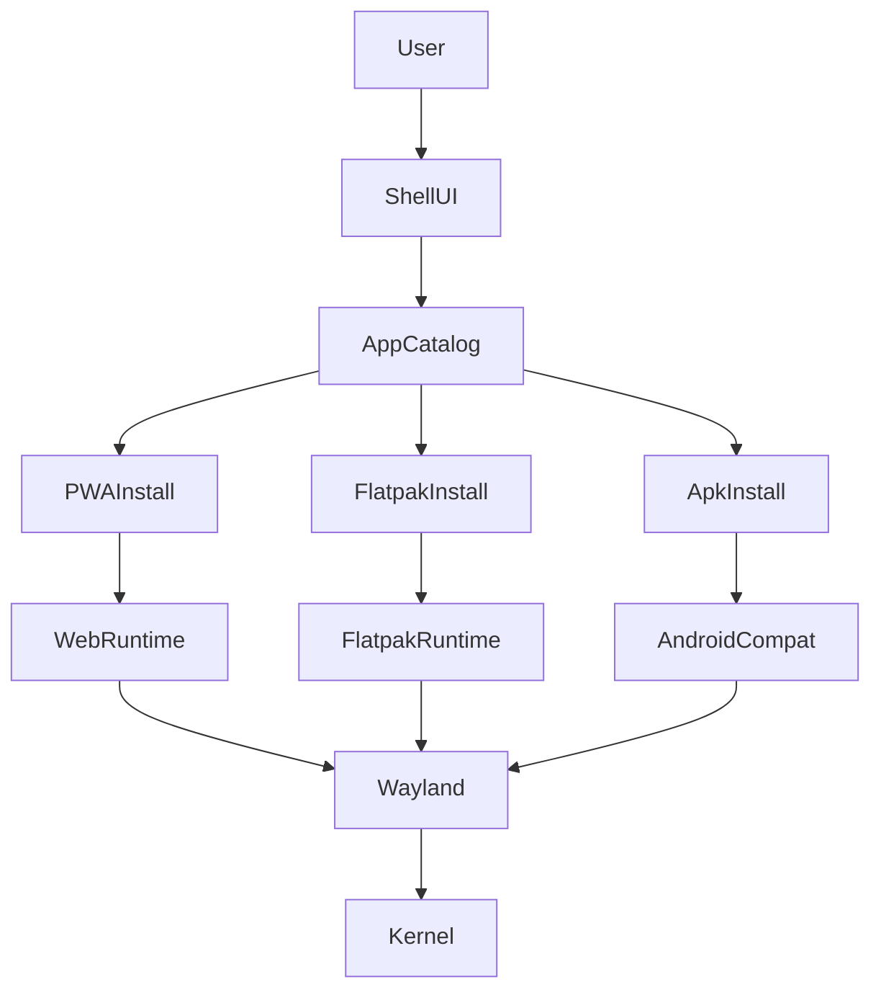

# Architecture

This repo is an implementation scaffold for a VM-first Linux OS that can claim a massive app ecosystem by **composing compatibility layers**:

- **Web/PWA** (largest long-tail app pool)
- **Linux desktop apps** via **Flatpak**
- **Android apps** via a containerized compatibility layer (later milestone)

## Target artifacts

- **Primary**: `qcow2` disk image for QEMU/UTM
- **Secondary**: `iso` installer/live image (optional)

## High-level components

## Base OS and boot

- **Kernel/base**: Linux + systemd
- **Image model**: VM-first disk image, designed to evolve toward an **immutable** base (A/B rollback) once the system update mechanism is in place
- **Session**: Wayland compositor session (Sway for MVP), autostarting the OS shell

## UI stack (MVP)

- **Compositor**: `sway` (Wayland)
- **Bar/launcher**: `waybar` + `wofi`
- **OS shell**: a single “home” surface that provides:
  - launcher
  - settings entry points
  - “catalog” entry points (Flatpak + PWA)

The MVP shell is intentionally simple so the app ecosystem work can proceed immediately.

## App ecosystems

### Linux apps (Flatpak)

- **Runtime**: Flatpak
- **Remote**: Flathub (or a mirrored remote)
- **Permissions**: portals + Flatseal-like UI for inspection/overrides

### Web/PWA

- **Runtime**: Chromium-based browser
- **Install flow**:
  - open site in browser
  - user triggers PWA install
  - OS provides a “PWA apps” section (desktop entries) and storage/permission controls

### Android compatibility (later)

- **Approach**: Waydroid-style Android container
- **Windowing**: Android apps presented as Wayland windows

## Data/control planes

- **Catalog metadata**: signed JSON index(es) describing available apps and install methods
- **Install execution**:
  - Flatpak installs via `flatpak install`
  - PWA installs via browser install UI / `--install-app` style hooks (varies by runtime)
  - Android installs via APK install tooling inside AndroidCompat

